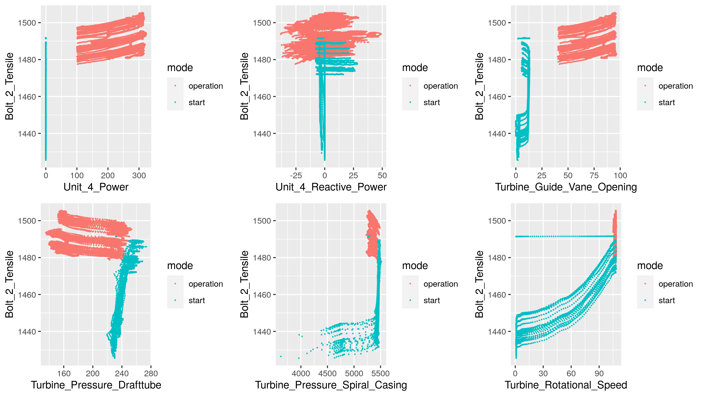
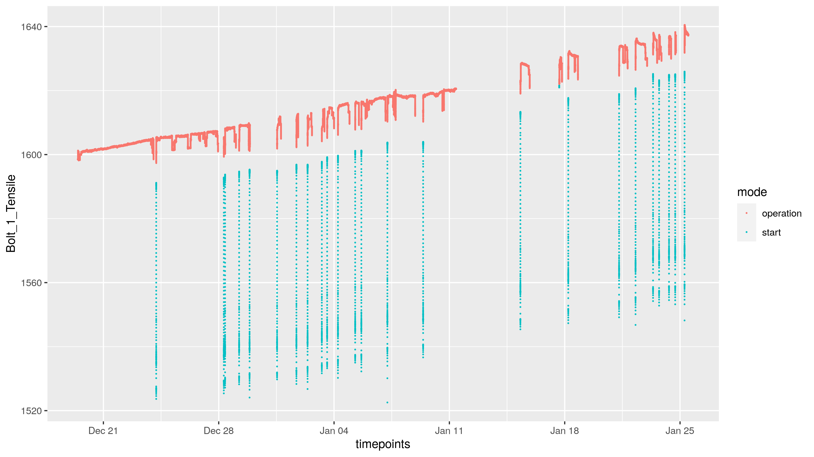
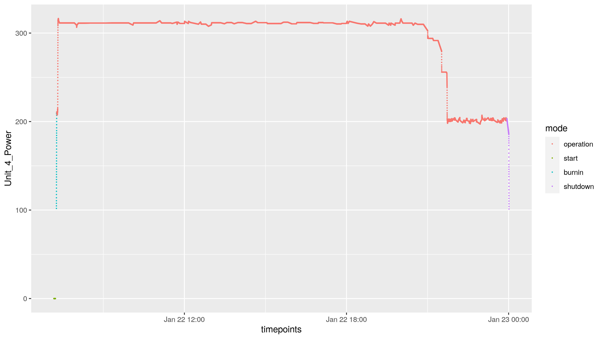

```{r setup, include=FALSE}
# library(changepoint)
# library(anomaly)
# library(capacc)
# library(ggplot2)
# library(ggpubr)

```

## Overview

## Data findings -- highly correlated covariates
{width=70%}
Reactive power just noise.

## Data findings -- tensile trend
{width=70%}

## Data findings -- Bump in some tensils after burnin
{width=70%}

## Data findings
- Apparentnon-stationarity (tried to remedy this by splitting into test data set with consecutive blocks of test/error of 200 seconds each)

## Augmentations

* Burn-in and shutdown modes.
{width=70%}
* Seconds since end of burn-in.

## Model considerations
We have used a simple linear regression model for each bolt seperately, with features being all possible interactions between the following variables:
- timepoints  
- Unit_4_Power
- Turbine_Guide_Vane_Opening   
- Turbine_Pressure_Drafttube
- Turbine_Pressure_Spiral_Casing
- Turbine_Rotational_Speed
- mode = ("start", "burnin", "operation", "shutdown")
- length since last startup

## Model considerations
The linear model is simple, with its only flexibility coming from the vast number of interactions

- Crossplots reveal that many relationships are linear or near-linear, and adding transformations of features has not improved prediction


## Putting it into production
- Mention re-training?
- Very fast prediction of new data points (only a linear combination)

## Scalability and transferability
- Scalability: yes, this is scalable. However, a problem is that the model is not re-trained on new data points. 
- Could consider re-training the model with robust regression

## Other things to do
- Possible smoothing of signal
- Fit robust models
- Anomaly detection


