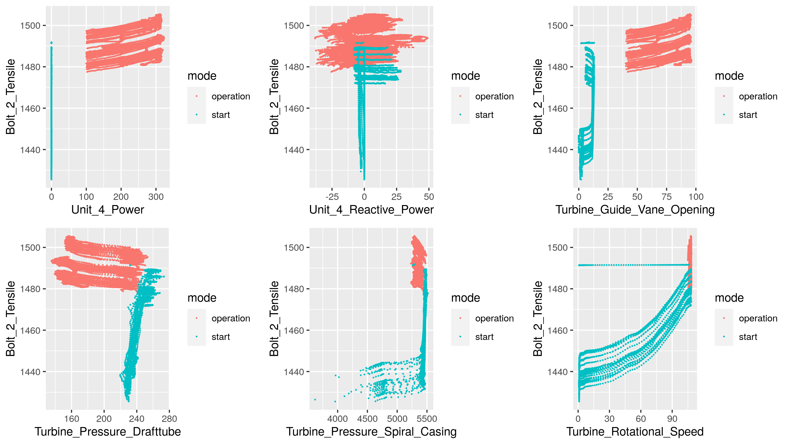
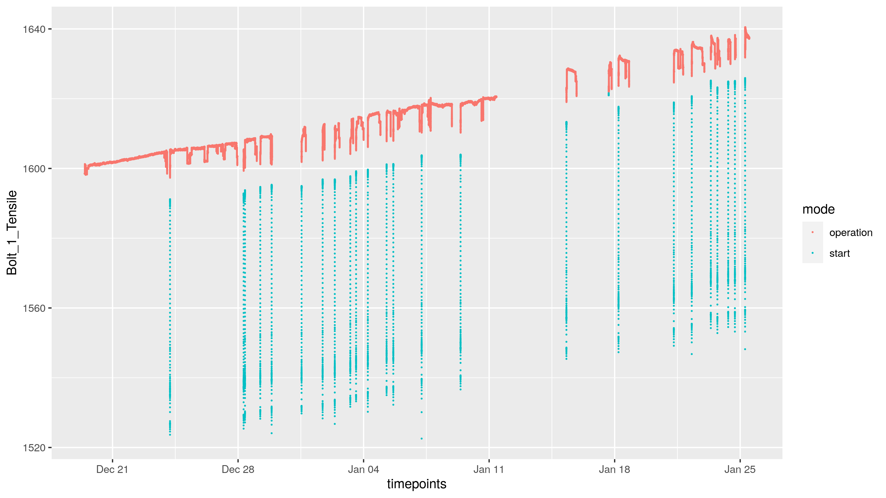
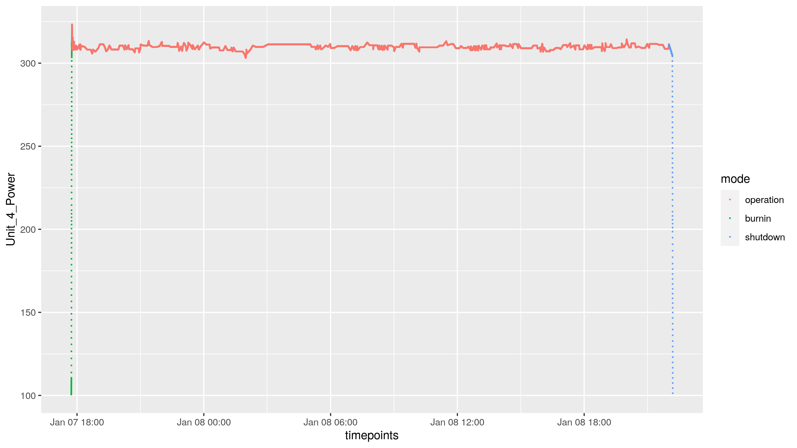
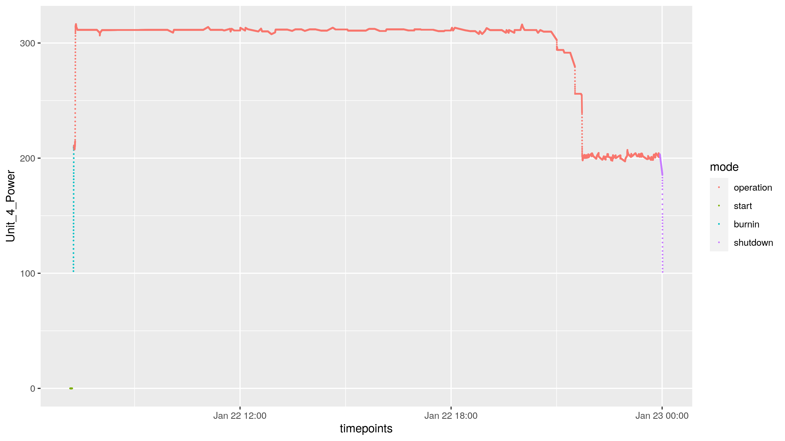

```{r setup, include=FALSE}
# library(changepoint)
# library(anomaly)
# library(capacc)
# library(ggplot2)
# library(ggpubr)

```

## Where to find the code
Our code is written into an R package which can be installed as such: 
You can install Krafthack2022 from github with:
```{r gh-installation, eval = FALSE}
# install.packages("devtools")
devtools::install_github("Tveten/Krafthack2022")
```
The code can also be found [here](https://github.com/Tveten/Krafthack2022). 

The code that produces the predictions is found in ../inst/data_prediction.R. 

## Overview
We have fitted separate a linear (ridge regression ) model to each bolt tensil using all possible interactions of the features. Our motivation for this choice of model is two-fold: firstly, we are curious as to how well such a simple model can perform; secondly, we find many linear relationships in the data, suggesting that a linear model can be a reasonable assumption.

## Data findings -- highly correlated covariates
{width=70%}

We find that most, if not all, of the features are highly correlated. For instance, the feature "Reactive power" is essentially just noise, and we choose to remove it from the model.

## Data findings -- tensile trend
{width=70%}

We find that there is a clear linear relationship between time and bolt tensiles. This suggests that a linear model can, although simple, be a reasonable model choice. 

## Data findings -- Bump in some tensils after burnin
{width=70%}

## Data findings
- In the data there is an apparent non-stationarity. In our model training, we tried to remedy this by splitting the data into training data and test data in the following fashion:  We split the data into consecutive blocks of 200 observations. Each block alternates between being used as test data or training data. 

## Augmentations -- burn-in and shutdown
<!-- * Burn-in and shutdown modes. -->
{width=70%}
<!-- * Seconds since end of burn-in. -->

We have chosen to augment the data set by introducing two new modes: "burnin" and "shutdown". 

## Augmentations -- bump feature
In addition, we have introduced a new feature $f$ given by 
$$
f = \frac{1}{t^{1/4}},
$$
where $t$ is the time since the last burnin period ended. $f$ is zero whenever the mode is not "operational". 

## Model considerations
We have used a simple [linear ridge regression model](https://en.wikipedia.org/wiki/Ridge_regression) for each bolt separately, with features being all possible interactions between the following variables:

- timepoints  
- Unit_4_Power
- Turbine_Guide_Vane_Opening   
- Turbine_Pressure_Drafttube
- Turbine_Pressure_Spiral_Casing
- Turbine_Rotational_Speed
- mode = ("start", "burnin", "operation", "shutdown")

In addition we have included the previously defined feature $f$ and its interactions with the remaining features. 

We use the "glmnet" package train the model.

## Model considerations
The (ridge) linear model is simple, with its only flexibility coming from the vast number of interactions. 

- Crossplots reveal that many relationships are linear or near-linear, and adding transformations of features has not improved prediction. 

- The ridge penalty reduces risk of overfitting


## Putting it into production
- Predicting new data points is very fast (only a linear combination)
- Training the models takes around 10-15 minutes on a single CPU core (the training is higly parallelizable)

## Scalability and transferability
- Scalability: The model is scalable, but an issue is that the model is not re-trained on new data points. An option is to consider re-training the model with robust regression, which even allows for anomalous points or segments to be included in the training set.

## Things we would have done if we had more time
- Smooth the predicted values, as they are quite noisy
- Fit the ridge regression/linear regression using robust models
- Perform anomaly detection by comparing the predicted values versus the observed values. There are several methods for this, such as CAPA-CC, OCD and Inspect. 


